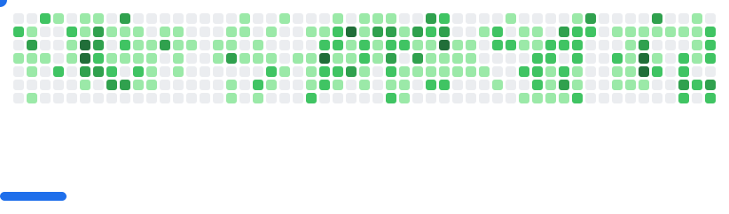

<div align="center">

# LAKSH SADHWANI
### aka [packedlama](https://github.com/packedlama)

`Backend Engineer` • `Fintech` • `Builder`


</div>

---

```bash
whoami
```
`Backend Engineer @ Razorpay`

```bash
build_mode
```
`Minimal. Sharp. Production-first.`

```bash
open_to
```
`High-quality collaborations & meaningful products`

---

<p align="center">
  <picture>
    <source media="(prefers-color-scheme: dark)" srcset="images/breakout-dark.svg" />
    <source media="(prefers-color-scheme: light)" srcset="images/breakout-light.svg" />
    
  </picture>
</p>

---

<div align="center">


</div>

---

<div align="center">

[LinkedIn](https://www.linkedin.com/in/sadhwanilaksh/)

</div>
