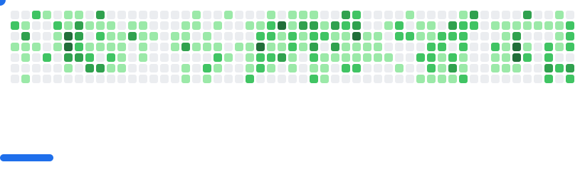

### Hi, I'm Laksh Sadhwani — [packedlama][packedlama_website] 👋

## Senior AI Backend Engineer · Building the Agentic SDLC

> *I don't just write software — I build the agents that help engineers write better software, faster.*

I own the **agentic engineering charter** at my org — from strategy and tooling selection to phased rollout across the full software development lifecycle. My work sits at the intersection of AI infrastructure, developer productivity, and production-grade LLM systems.

---

### 🤖 What I've Built

**Cost-Aware Model Routing**
Designed a task-complexity routing strategy across Claude Opus, Sonnet, and Haiku — Opus for deep reasoning (TRD/TDD generation), Sonnet for day-to-day agent execution, Haiku for high-volume low-latency tasks. Cut per-task inference cost by **~35%** with no quality degradation.

**Documentation Retrieval & Routing Layer (MCP)**
Built a vector DB–backed documentation layer with a hyperlink-aware routing interface exposed as an MCP server. Agents query live docs on demand — no stale context. Added prompt caching and chat summarization every 3rd iteration to contain context growth, reducing token spend by **~30%** on long-running sessions.

**PR Review Agent**
Ingests diffs and cross-references 12 months of historical review comments as a team-calibrated quality corpus. Delivers context-aware, standards-aligned feedback before human reviewers ever open the PR — cutting review cycle time by **~40%**.

**SDLC Lifecycle Agent Suite**
End-to-end pipeline: Jira ticket intake → auto-generated TRDs and TDD scaffolds → Coralogix log correlation → Slack history retrieval for past-issue context → doc hyperlink validation. Collectively reduced feature delivery overhead by **4 weeks per engineer per quarter**.

**GUI Testing Emulator Agent**
Autonomously provisions Android/iOS emulators, executes test flows, captures screenshots, and produces visual regression reports — cutting manual QA setup time by **70%**.

**Onboarded 12+ engineers** onto agent-assisted workflows within the first month of rollout.

---

### 🛠 Tech Stack

`Python` · `Claude API (Opus / Sonnet / Haiku)` · `MCP Servers` · `Vector Databases` · `Jira API` · `Coralogix` · `Slack API` · `Android/iOS Emulators` · `Git/GitHub` · `Shell Scripting`

---

<picture>
  <source media="(prefers-color-scheme: dark)" srcset="images/breakout-dark.svg" />
  <source media="(prefers-color-scheme: light)" srcset="images/breakout-light.svg" />
  
</picture>

🎇 Github Stats | 🎇 Top Languages
:---:|:---:
 | 

---

**Want to talk AI infra, agentic systems, or build something together?**
📧 laksh.sadhwani07@gmail.com · [LinkedIn][linkedin]

[packedlama_website]: https://github.com/packedlama
[linkedin]: https://www.linkedin.com/in/sadhwanilaksh/
